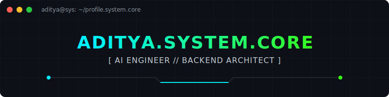

<div align="center">
  
</div>

<br>

```text
> initializing_aditya_profile...
> loading_modules... [AI, Backend, RAG]
> authentication: SUCCESS
> access_level: ROOT
```

<h1 align="center">
  
</h1>
